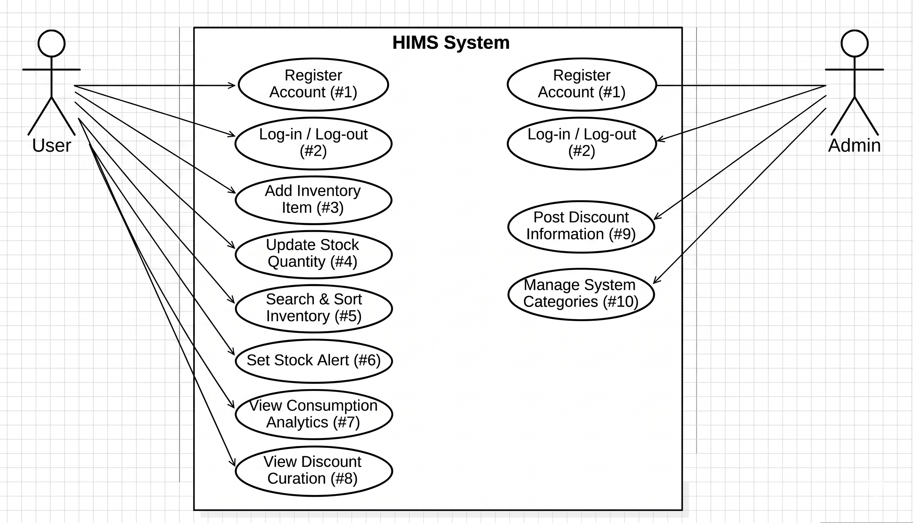

# 통합 가계 자산 및 생필품 관리 시스템 "Household Inventory Management System" - Analysis Document

**학번:** 22211984  
**이름:** 박준혁  
**이메일:** groovejr@naver.com

---

## 1. Introduction

### 1) Executive Summary
1인 가구와 대학생 자취생들에게 ‘살림’은 번거롭고 관리하기 어려운 영역이다. 식재료의 유통기한을 놓쳐 폐기하거나, 잔량을 파악하지 못해 생필품을 중복 구매하는 일이 빈번하게 발생한다. 기존의 메모 앱이나 스마트 가전은 자취생이 접근하기에 기능이 부족하거나 비용이 너무 비싸다는 한계가 있다.
이러한 자원 낭비와 경제적 손실을 방지하기 위해 데이터 기반의 자취생 맞춤형 재고 관리 시스템인 **“HIMS (Household Inventory Management System)”**를 설계하였다. 본 시스템은 사용자가 본인의 주거 공간 내 재고를 디지털화하여 실시간으로 추적하고, 소비 패턴을 분석하며, 주변 상권의 할인 정보를 공유받을 수 있는 통합 플랫폼이다.

### 2) Business Goals
HIMS의 궁극적인 목적은 1인 가구의 쾌적한 주거 환경 조성과 경제적 자립을 돕는 것이다. 사용자는 직관적인 입력을 통해 재고 상태와 유통기한을 한눈에 파악할 수 있어 불필요한 과소비를 막고 자원 폐기를 최소화한다. 더 나아가 시스템 관리자가 제공하는 지역 마트 할인 정보 및 공동구매 큐레이션을 통해 실질적인 생활비 절감 효과를 얻을 수 있으며, 통계 기반의 객관적인 소비 지표를 통해 스마트한 경제 관념을 형성할 수 있다.

### 3) Technical Goals
본 시스템은 Client-Server 아키텍처를 기반으로 하며, 실시간 동기화와 데이터 무결성을 최우선 목표로 한다. Server 측면에서는 Firebase Cloud DB를 활용하여 네트워크 지연을 1.5초 이내로 단축한 실시간 데이터 동기화를 구현한다. 사용자 인증(Authentication) 및 보안 규칙(Security Rules)을 철저히 설정하여 일반 회원(User)의 개인 데이터는 철저히 격리하고, 관리자(Admin)만이 공용 데이터(카테고리, 할인 정보)에 접근할 수 있도록 권한을 엄격하게 분리한다. Client 측면에서는 JavaScript 및 웹/모바일 프레임워크를 활용하여 직관적이고 빠른 렌더링이 가능한 GUI를 제공하며, 오프라인 상태에서도 데이터를 캐싱하여 네트워크 재연결 시 누락 없이 동기화되도록 설계한다.

---

## 2. Use case analysis

### 2.1. Use Case Diagram
*(시스템의 전반적인 기능을 User와 Admin Actor를 중심으로 나눈 Use Case Diagram이 들어갈 자리입니다. 아래는 해당 다이어그램을 구성하는 Use Case 명세표입니다.)*

| Use Case Name | Use Case ID | Korean Name | Actor |
| :--- | :---: | :--- | :--- |
| Register Account | #1 | 계정 등록 | User, Admin |
| Log-in / Log-out | #2 | 로그인 / 로그아웃 | User, Admin |
| Add Inventory Item | #3 | 재고 품목 추가 | User |
| Update Stock Quantity | #4 | 재고 수량 변경 | User |
| Search & Sort Inventory | #5 | 재고 검색 및 정렬 | User |
| Set Stock Alert | #6 | 재고 부족 알림 설정 | User |
| View Consumption Analytics | #7 | 소비 패턴 분석 조회 | User |
| View Discount Curation | #8 | 할인 정보 조회 | User |
| Post Discount Information | #9 | 할인 정보 게시 | Admin |
| Manage System Categories | #10 | 시스템 카테고리 관리 | Admin |

### 2.2. Use Case Description

#### 2.2.1. Add Inventory Item
**Use Case #3 : Add Inventory Item**

| 항목 | 내용 |
| :--- | :--- |
| **Summary** | 사용자가 새로 구매한 생필품이나 식재료의 정보를 시스템에 등록한다. |
| **Scope** | HIMS |
| **Level** | User level |
| **Primary Actor** | User |
| **Secondary Actors**| Firebase Server |
| **Preconditions** | 시스템에 정상적으로 로그인이 되어 있는 상태여야 한다. |
| **Trigger** | 메인 화면에서 '품목 추가(+)' 버튼을 클릭했을 때. |
| **Success Post Condition** | 입력한 품목 데이터가 Firebase DB에 저장되고 사용자 화면 리스트에 즉시 반영된다. |
| **Failed Post Condition** | 필수 입력 사항(품목명, 카테고리 등)이 누락되었거나 네트워크 연결이 끊긴 경우 등록이 보류된다. |

**[MAIN SUCCESS SCENARIO]**
1. 사용자가 메인 재고 관리 화면에서 '품목 추가' 버튼을 누른다.
2. 시스템이 품목명, 카테고리, 수량, 유통기한을 입력할 수 있는 폼(Form)을 제공한다.
3. 사용자가 세부 정보를 입력하거나, 미리 지정해둔 '즐겨찾기(Preset)' 품목을 선택한다.
4. '저장' 버튼을 누른다.
5. 시스템이 입력된 데이터의 유효성을 검사한 후 Server로 전송한다.
6. 데이터가 성공적으로 동기화되면 시스템은 메인 리스트를 업데이트하고 성공 알림을 띄운다.

**[EXTENSION SCENARIOS]**
* **3a. 유통기한을 모르는 품목일 경우:**
  * 3a1. 유통기한 입력란을 공란으로 두거나 '해당 없음(생필품 등)' 옵션을 선택하여 진행할 수 있다.
* **5a. 네트워크가 오프라인 상태일 경우:**
  * 5a1. 시스템이 로컬 캐시에 우선 저장하고, "오프라인 상태입니다. 연결 시 동기화됩니다."라는 메시지를 띄운다.

#### 2.2.2. Update Stock Quantity
**Use Case #4 : Update Stock Quantity**

| 항목 | 내용 |
| :--- | :--- |
| **Summary** | 물건을 사용하거나 소비함에 따라 현재 재고의 잔량을 실시간으로 수정한다. |
| **Scope** | HIMS |
| **Level** | User level |
| **Primary Actor** | User |
| **Secondary Actors**| Firebase Server |
| **Preconditions** | 본인의 재고 리스트에 1개 이상의 품목이 등록되어 있어야 한다. |
| **Trigger** | 재고 리스트 항목 옆에 있는 수량 증감(+, -) 버튼을 클릭했을 때. |
| **Success Post Condition** | 변경된 수량이 DB에 업데이트되며, 수량이 '최소 유지 수량' 도달 시 알림이 활성화된다. 수량이 0이 되면 소진 상태로 변경된다. |

**[MAIN SUCCESS SCENARIO]**
1. 사용자가 재고 리스트에서 소모한 특정 물품의 수량 차감(-) 버튼을 누른다.
2. 시스템이 수량 데이터를 즉시 1 감소시킨다.
3. 변경된 값을 Server 데이터베이스에 즉각 반영한다.
4. 만약 변경된 수량이 0이라면, 해당 품목을 비활성화(회색 처리)하거나 '소진된 항목' 탭으로 이동시킨다.

#### 2.2.3. Post Discount Information
**Use Case #9 : Post Discount Information**

| 항목 | 내용 |
| :--- | :--- |
| **Summary** | 관리자가 지역 마트의 할인 행사나 생필품 특가 정보를 전체 사용자에게 배포한다. |
| **Scope** | HIMS |
| **Level** | User level |
| **Primary Actor** | Admin |
| **Secondary Actors**| Firebase Server |
| **Preconditions** | 관리자 권한(Admin) 계정으로 로그인이 되어 있어야 한다. |
| **Trigger** | 관리자 대시보드에서 '할인 정보 작성' 메뉴를 실행했을 때. |
| **Success Post Condition** | 작성된 게시물이 Server DB의 Public 섹션에 저장되며, 모든 일반 사용자의 메인 화면 배너에 노출된다. |

**[MAIN SUCCESS SCENARIO]**
1. 관리자가 대시보드에서 해당 기능을 실행한다.
2. 프로모션 제목, 세부 할인 품목, 판매처, 행사 유효 기간을 입력하는 창이 열린다.
3. 정보를 작성하고 '게시하기' 버튼을 누른다.
4. 시스템이 Server에 데이터를 업로드한다.
5. 업로드 성공 시, 시스템을 이용 중인 모든 User의 화면에 실시간으로 새로운 할인 정보 알림표시가 나타난다.

---

## 3. Domain analysis

아래는 HIMS 시스템의 핵심 Domain Class들과 그 역할을 분석한 내역입니다.

1. **UserAccount**: User와 Admin Actor가 공통으로 갖는 계정 정보(UID, Email, Password, Role)를 정의하는 클래스이다. Firebase Authentication 모듈과 직접적으로 연결된다.
2. **InventoryManager**: User Actor가 소유한 전체 재고 리스트를 관리하고, 검색 및 정렬 기능을 수행하는 컨트롤러 성격의 클래스이다.
3. **Item (Entity)**: 시스템에 등록되는 개별 물품을 정의하는 클래스이다. (속성: itemId, name, quantity, expirationDate, categoryId 등).
4. **Category (Entity)**: 품목의 성격을 분류하기 위한 메타데이터 클래스이다. Admin에 의해 중앙 관리되며, User는 Item 등록 시 이를 참조한다.
5. **AnalyticsEngine**: User의 누적된 데이터를 바탕으로 월간 소비 비중, 품목별 소진 주기를 연산하여 차트용 데이터를 반환하는 분석 클래스이다.
6. **AlertController**: 설정된 `minAlertQty` 값과 현재 `quantity`, 그리고 현재 날짜와 `expirationDate`를 비교하여 재고 부족 및 유통기한 임박 알림 이벤트를 발생시키는 감시자 역할을 수행한다.
7. **PromotionBoard**: Admin이 작성한 외부 할인 정보 및 공지사항 데이터를 담고 있는 공용 클래스이다.

---

## 4. User Interface prototype

### 4.1. General User Interface

#### 4.1.1. Login / Register
앱 실행 시 가장 먼저 표시되는 진입 화면이다. 이메일과 비밀번호 입력 폼이 중앙에 배치되어 있으며, 하단에 "회원가입" 버튼이 존재한다. 초기 사용자가 회원가입을 진행할 경우 Firebase Authentication을 통해 고유 UID가 발급되어 본인만의 독립된 재고 공간이 생성된다.

#### 4.1.2. Main Inventory Dashboard
사용자가 가장 자주 보게 될 메인 화면이다.
* **상단 배너:** 관리자가 올린 최신 할인/공동구매 큐레이션 정보가 슬라이드 형태로 제공된다.
* **리스트 영역:** 현재 보유 중인 생필품 및 식재료 리스트가 카드 형태로 나열된다. 각 카드에는 품목명, 남은 수량, 유통기한 D-Day가 직관적으로 표시된다.
* **수량 조절:** 카드 우측에 (+), (-) 버튼이 있어 한 번의 터치로 재고를 실시간 조절할 수 있다.
* **시각적 알림:** 수량이 부족하거나 유통기한이 3일 이내로 남은 항목은 테두리가 붉은색으로 강조되어 직관적인 인지를 돕는다.

#### 4.1.3. Add Item Modal
우측 하단의 플로팅 액션 버튼(+)을 누르면 하단에서 위로 올라오는 모달(Modal) 창이다.
사용자가 자주 사는 물품(예: 생수, 화장지, 라면)을 등록해 둔 **'Preset(즐겨찾기)'** 버튼들이 상단에 있어 클릭 한 번에 폼이 채워진다. 직접 입력 시에는 카테고리 드롭다운, 품목명 입력란, 수량 롤러, 달력 형태의 유통기한 선택기가 제공된다.

#### 4.1.4. Consumption Analytics
하단 네비게이션 탭에서 '분석'을 누르면 나타나는 화면이다.
이번 달 소비한 품목들의 카테고리별 비중이 파이 차트(Pie Chart) 형태로 그려진다. 하단에는 "샴푸 교체 주기는 평균 45일입니다", "이번 달 식재료 소비가 지난달 대비 15% 증가했습니다" 등 시스템이 계산한 소비 인사이트가 텍스트 형태로 출력된다.

### 4.2. Admin Interface

#### 4.2.1. Admin Dashboard
관리자 계정으로 로그인했을 때 보이는 별도의 화면이다. 현재 시스템 활성 유저 수와 등록된 총 데이터 건수를 요약해서 보여준다.
카테고리 관리 탭과 게시물 관리 탭으로 나뉘어 있으며, '새 할인 정보 등록' 버튼을 누르면 전체 사용자에게 푸시 알림과 함께 배너를 띄울 수 있는 에디터 폼이 제공된다.

---

## 5. Glossary

| Terms | Description |
| :--- | :--- |
| **UID (User Identifier)** | Firebase 등에서 계정을 생성할 때 부여받는 고유 식별자. 각 사용자의 독립적인 DB 접근 권한을 제어하는 핵심 키로 사용된다. |
| **즐겨찾기 (Preset)** | 사용자가 주기적으로 구매하는 품목을 미리 저장해 두어, 재입고 시 일일이 타이핑하지 않고 버튼 하나로 재고를 리스트에 추가할 수 있는 기능. |
| **최소 유지 수량 (Min Alert Qty)** | 특정 생필품이 이 수량 밑으로 떨어지면 시스템이 사용자에게 "구매 필요" 알림을 보내도록 설정하는 기준값. |
| **실시간 동기화 (Real-time Sync)** | Client 앱에서 수량을 변경하는 즉시 Server DB에 값이 반영되고, 동시에 연동된 다른 기기(예: 태블릿, 웹)의 화면에도 새로고침 없이 즉각 적용되는 상태. |
| **할인 큐레이션** | 무분별한 광고가 아닌, 관리자가 1인 가구에게 실질적으로 유용한 지역 마트 전단지 및 특가 행사만을 선별하여 제공하는 정보 게시물. |
| **데이터 무결성** | 시스템 에러나 네트워크 지연 등으로 인해 실제 사용자가 가지고 있는 물건의 개수와 시스템 상의 데이터가 어긋나지 않고 정확히 일치하는 특성. |

---

## 6. References

* **푸드투데이 (Foodtoday)** - "[그래픽 뉴스] 1인 가구, 식품 절반은 '음식물쓰레기'로 버린다" (2020.03.09) - (유통기한 관리 기능 도출 근거)
* **Firebase Documentation** (Realtime Database & Authentication Rules) - 데이터베이스 동기화 및 보안 규칙 설계 참고.
