# 통합 가계 자산 및 생필품 관리 시스템 "Household Inventory Management System"

**학번:** 22211984  
**이름:** 박준혁  
**이메일:** groovejr@naver.com

---

## 1. Introduction
옛날부터 1인 가구, 특히 대학생 자취생들에게 ‘살림’은 늘 뒷전이기 일쑤였다.
학업과 아르바이트에 치이다 보면 냉장고 구석에 박혀 형체를 알 수 없게 변해버린 식재료를 발견하거나, 샤워를 하려다 뒤늦게 떨어진 샴푸를 확인하고 당황하는 일은 자취생들의 흔한 일상이자 고질적인 불쾌함이다.
단순히 귀찮음을 넘어, 유통기한이 지나 버려지는 음식물 쓰레기와 이미 집에 있는 생필품을 또 구매하게 되는 ‘중복 지출’은 자취생들의 얇은 지갑을 위협하는 실질적인 경제적 손실로 이어진다.
그러나 이러한 불편함에도 불구하고 기존의 해결책은 포스트잇에 수동으로 적어두거나 막연한 기억력에 의존하는 수준에 머물러 있다.
시중에 나온 대형 가전사의 스마트 냉장고는 자취생들이 구매하기엔 지나치게 고가이며, 일반적인 메모 앱은 유통기한 알림이나 소비 패턴 분석 기능을 제공하지 않아 체계적인 관리가 불가능하다.
그래서 이러한 자원 낭비를 막고, 자취생들이 좁은 주거 공간에서도 쾌적하고 경제적인 생활을 누리도록 돕고 싶었다. 그리하여 데이터 기반의 자취생 맞춤형 재고 관리 시스템인 **“HIMS: Household Inventory Management System”**를 개발하게 되었다.
이 프로그램을 통해 이루고자 하는 첫 번째 목표는 철저한 자산 및 재고의 최적화다. 사용자별 독립된 데이터베이스를 구축하여 내가 가진 모든 생필품의 수량과 유통기한을 추적한다.
'딸깍' 한 번의 입력으로 재고 현황을 디지털화하고, 유통기한 임박 시 시각적 알림을 제공하여 버려지는 자원을 원천 차단하는 것이 첫 번째 목표이다.
그 다음으로는 데이터 기반의 현명한 소비 가이드다. 단순히 쌓아두는 것을 넘어, 사용자의 누적된 소비 데이터를 분석하여 품목별 교체 주기와 월간 소비량을 통계로 보여준다.
이를 통해 본인의 소비 습관을 파악하고 불필요한 과잉 소비를 줄이는 것이 두 번째 목표이다.
본 시스템은 단순히 개인의 관리에만 국한되지 않는다. 시스템 관리자(Admin)가 주변 마트의 할인 정보나 공동구매 소식을 실시간으로 배포함으로써, 사용자는 더 저렴하게 물품을 보충하고 관리자는 유효한 정보를 전달하는 **'자취생 통합 정보 허브'**로 그 범위를 무한히 확장할 수 있다.
이 시스템의 주 타겟은 매달 한정된 생활비 안에서 효율적인 살림 운영이 절실한 모든 1인 가구 및 대학생 자취생이 될 것이다.
학교 인근 원룸촌이나 오피스텔에 거주하며 식재료 관리에 어려움을 겪는 학생들은 물론, 첫 독립을 시작하여 살림 노하우가 부족한 사회 초년생들에게 필수적인 생활 도구로 자리 잡을 수 있다.
결과적으로 **“HIMS”**는 단순히 물건 개수를 세는 장치를 넘어, 1인 가구의 경제적 자립과 주거 환경의 쾌적화라는 두 마리 토끼를 잡는 시스템이다. 이를 통해 자취 생활의 번거로움을 '스마트한 관리'와 '절약의 즐거움'으로 바꾸어 주는 차세대 생활 밀착형 솔루션을 지향한다.

## 2. Class Diagram
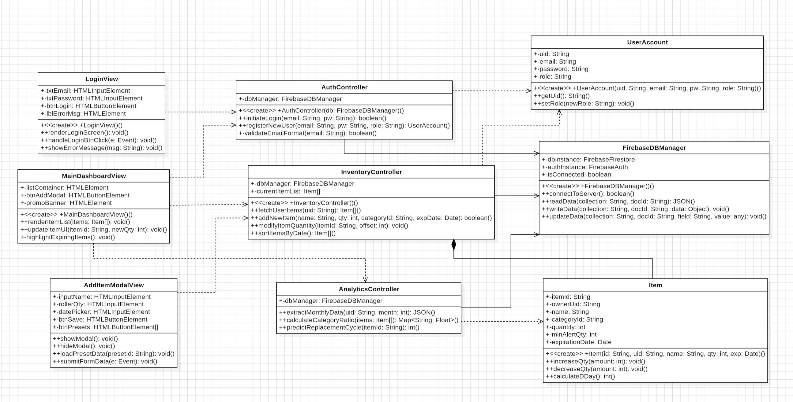

아래의 표는 위의 Class Diagram에서 표현한 Class들의 대한 설명이다.

| **FirebaseDBManager** | Firebase 데이터베이스(Firestore) 및 인증 서버와의 통신을 전담하여 데이터를 읽고 쓰는 유틸리티 클래스이다. |
| :--- | :--- |
| | -dbInstance, -authInstance, -isConnected : Firebase의 데이터베이스 및 권한 인증 인스턴스를 담고, 현재 서버와의 연결 상태를 논리값으로 저장하는 변수들이다. |
| | <<create>> +FirebaseDBManager() : 통신 매니저 객체를 초기화하는 생성자이다. |
| | +connectToServer() : 서버와의 초기 연결을 시도하고 정상적으로 연동되었는지 성공 여부를 반환하는 메소드이다. |
| | +readData(collection : String, docId : String) : 특정 데이터 컬렉션과 문서 ID를 기반으로 서버에서 데이터를 읽어와 JSON 형태로 반환하는 메소드이다. |
| | +writeData(collection : String, docId : String, data : Object) : 입력받은 새로운 객체 데이터를 지정된 경로(컬렉션 및 문서 ID)에 새롭게 저장하는 메소드이다. |
| | +updateData(collection : String, docId : String, field : String, value : any) : 기존에 존재하는 데이터 문서에서 특정 필드 값만 찾아 새로운 값으로 수정(업데이트)하는 메소드이다. |

| **AuthController** | 시스템 사용을 위한 회원가입 로직과 로그인 시 아이디/비밀번호 검증 등 인증과 관련된 비즈니스 로직을 제어하는 클래스이다. |
| :--- | :--- |
| | -dbManager : 데이터 처리를 위해 FirebaseDBManager 객체와 연결하여 의존하는 변수이다. |
| | <<create>> +AuthController(db : FirebaseDBManager) : DB 매니저를 매개변수로 받아 컨트롤러를 초기화하는 생성자이다. |
| | +initiateLogin(email : String, pw : String) : 입력란에 입력한 이메일과 비밀번호를 서버로 보내 등록된 회원인지 확인하고, 로그인 성공 여부를 반환하는 메소드이다. |
| | +registerNewUser(email : String, pw : String, role : String) : 신규 유저의 가입 정보를 받아 서버에 등록하고, 생성된 계정(UserAccount) 객체를 반환하는 메소드이다. |
| | -validateEmailFormat(email : String) : 회원가입 또는 로그인 시 입력한 이메일의 문자열 형식이 올바른지 내부적으로 검증하는 메소드이다. |

| **InventoryController** | 사용자의 생필품 및 식재료 재고를 추가, 삭제, 수정, 조회하는 핵심 비즈니스 로직을 처리하는 클래스이다. |
| :--- | :--- |
| | -dbManager : DB 통신을 위한 객체 참조 변수이다. |
| | -currentItemList : 현재 로그인한 사용자가 보유하고 있는 재고 아이템 객체들을 묶어 관리하는 배열(List)이다. |
| | <<create>> +InventoryController() : 재고 관리 컨트롤러를 초기화하는 생성자이다. |
| | +fetchUserItems(uid : String) : 로그인한 사용자의 고유 식별자(UID)를 바탕으로 DB에서 해당 사용자의 모든 재고 데이터를 불러오는 메소드이다. |
| | +addNewItem(name : String, qty : int, categoryId : String, expDate : Date) : 새로 구매한 물품의 세부 정보를 받아 DB에 등록하고 성공 여부를 반환하는 메소드이다. |
| | +modifyItemQuantity(itemId : String, offset : int) : 물건 사용 시 해당 아이템의 수량을 지정한 오프셋(증감분)만큼 변화시키는 실시간 수량 조절 메소드이다. |
| | +sortItemsByDate() : 화면에 띄울 재고 아이템들을 유통기한이 임박한 순서대로 정렬하여 배열 형태로 반환하는 메소드이다. |

| **AnalyticsController** | 누적된 사용자의 재고 입출력 데이터를 바탕으로 소비 패턴과 통계를 계산하는 클래스이다. |
| :--- | :--- |
| | -dbManager : DB 통신을 위한 객체 참조 변수이다. |
| | +extractMonthlyData(uid : String, month : int) : 특정 사용자의 특정 월에 해당하는 소비 데이터 로그를 DB에서 추출하여 JSON 데이터로 반환하는 메소드이다. |
| | +calculateCategoryRatio(items : Item[]) : 사용자의 재고 목록을 기반으로 식품, 세제 등 각 카테고리별 소비 비중을 계산하여 맵(Map) 자료구조 형태로 반환하는 메소드이다. |
| | +predictReplacementCycle(itemId : String) : 특정 품목의 과거 소진 기록을 분석하여, 향후 재구매(교체)가 필요한 주기(일수)를 예측하여 반환하는 메소드이다. |

| **LoginView** | 시스템 실행 시 가장 먼저 띄워지며, 사용자가 이메일과 비밀번호를 입력하여 로그인을 요청할 수 있는 인터페이스(GUI) 클래스이다. |
| :--- | :--- |
| | -txtEmail, -txtPassword, -btnLogin, -lblErrorMsg : 각각 이메일 입력란, 비밀번호 입력란, 로그인 실행 버튼, 그리고 오류 발생 시 텍스트를 띄워줄 에러 메시지 라벨 등 화면 구성 요소들이다. |
| | <<create>> +LoginView() : 로그인 뷰를 초기화하는 생성자이다. |
| | +renderLoginScreen() : 화면에 실제 로그인 폼과 UI 요소들을 렌더링(출력)하는 메소드이다. |
| | +handleLoginBtnClick(e : Event) : 로그인 버튼이 클릭되는 이벤트를 감지하여 입력된 텍스트를 AuthController로 넘겨주는 메소드이다. |
| | +showErrorMessage(msg : String) : 로그인 실패 등 예외 상황 발생 시, 사용자에게 원인을 알리는 메시지 라벨을 화면에 띄우는 메소드이다. |

| **MainDashboardView** | 로그인이 성공적으로 완료된 후, 사용자의 전체 재고 리스트와 상단 할인 프로모션 정보를 띄워주는 메인 화면 클래스이다. |
| :--- | :--- |
| | -listContainer, -btnAddModal, -promoBanner : 재고 목록이 나열될 컨테이너 구역, 새로운 물건을 추가할 수 있는 버튼, 지역 할인 정보가 표시되는 상단 배너 요소들이다. |
| | <<create>> +MainDashboardView() : 메인 대시보드 화면을 초기화하는 생성자이다. |
| | +renderItemList(items : Item[]) : InventoryController로부터 전달받은 아이템 배열을 화면상에 카드 형태의 리스트로 나열하여 보여주는 메소드이다. |
| | +updateItemUI(itemId : String, newQty : int) : 특정 물품의 수량 변화가 생겼을 때, 화면 전체를 새로고침하지 않고 해당 항목의 UI 숫자만 즉시 변경해 주는 메소드이다. |
| | -highlightExpiringItems() : 화면에 렌더링된 리스트 중 유통기한이 임박한 항목의 테두리를 붉은색 등으로 시각적 강조 처리하는 메소드이다. |

| **AddItemModalView** | 메인 화면에서 추가(+) 버튼을 눌렀을 때, 새로운 물건의 정보를 입력받기 위해 화면 위로 팝업되는 모달(Modal) 창 클래스이다. |
| :--- | :--- |
| | -inputName, -rollerQty, -datePicker, -btnSave, -btnPresets : 물품명 입력란, 수량 증감 롤러, 유통기한을 선택하는 달력 요소, 최종 저장 버튼, 그리고 자주 사는 항목을 한 번에 입력하게 해주는 즐겨찾기(Preset) 버튼 배열이다. |
| | +showModal() / +hideModal() : 물품 추가 창을 화면상에 나타나게 하거나 다시 숨기는 메소드이다. |
| | +loadPresetData(presetId : String) : 사용자가 즐겨찾기 버튼을 클릭했을 때, 저장된 기본 데이터(품목명, 카테고리 등)를 입력 폼에 자동으로 채워주는 메소드이다. |
| | +submitFormData(e : Event) : 폼에 작성된 데이터를 수집하여 InventoryController의 재고 추가 로직으로 전달하는 메소드이다. |

| **UserAccount** | 시스템을 이용하는 사용자의 기본 계정 정보를 담고 있는 데이터 모델(엔티티) 클래스이다. |
| :--- | :--- |
| | -uid, -email, -password, -role : 가입 시 부여받는 고유 식별자(UID), 이메일, 비밀번호, 그리고 해당 계정이 일반 유저(USER)인지 시스템 관리자(ADMIN)인지 구분하는 권한 정보를 담은 변수들이다. |
| | <<create>> +UserAccount(uid : String, email : String, pw : String, role : String) : 사용자 계정 객체를 메모리에 할당하고 초기화하는 생성자이다. |
| | +getUid() : 해당 사용자 객체의 고유 식별자(UID) 문자열을 반환하는 메소드이다. |
| | +setRole(newRole : String) : 사용자의 시스템 이용 권한(일반 사용자/관리자)을 변경하거나 세팅하는 메소드이다. |

| **Item** | 사용자가 소유하고 관리하는 개별 생필품 또는 식재료 하나하나의 상세 상태를 담고 있는 데이터 모델(엔티티) 클래스이다. |
| :--- | :--- |
| | -itemId, -ownerUid, -name, -categoryId, -quantity, -minAlertQty, -expirationDate : 아이템 고유 식별자, 소유한 유저의 UID, 물품명, 소속 카테고리 ID, 현재 보유 수량, 재고 부족 알림을 띄울 최소 임계 수량, 그리고 유통기한 일자 등을 담는 변수들이다. |
| | <<create>> +Item(id : String, uid : String, name : String, qty : int, exp : Date) : 재고 항목 객체를 초기화하는 생성자이다. |
| | +increaseQty(amount : int) / +decreaseQty(amount : int) : 물건을 새로 사오거나 소모했을 때, 현재 객체의 수량 속성을 지정한 값만큼 증가 혹은 감소시키는 메소드이다. |
| | +calculateDDay() : 시스템의 현재 날짜와 등록된 유통기한 일자(expirationDate)를 비교 연산하여, 기한이 며칠 남았는지를 일수(D-Day)로 반환하는 메소드이다. |

## 3) Sequence Diagram
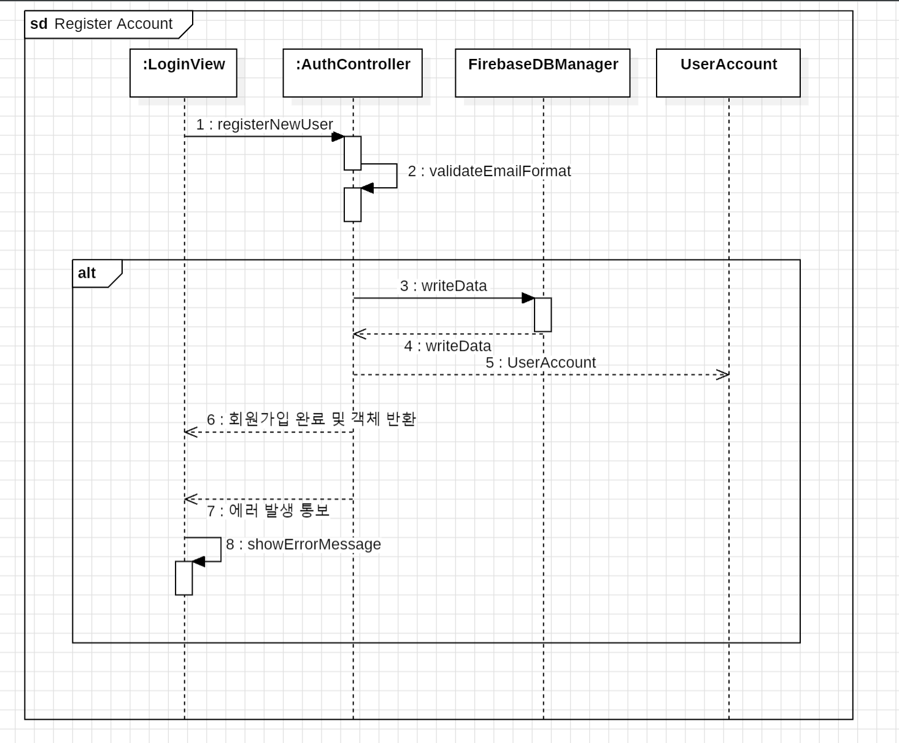

1. 회원가입 (Register Account)

시스템 실행 후 신규 사용자가 회원가입 기능을 수행할 때를 표현한 Sequence Diagram이다. 로그인 화면(LoginView)에서 이메일과 비밀번호를 입력해 가입을 요청하면, 인증 컨트롤러(AuthController)가 내부적으로 이메일 형식이 유효한지 검사(validateEmailFormat)한다. 형식이 올바르다면 DB 매니저(FirebaseDBManager)를 통해 서버에 데이터를 저장하고, 성공 시 새로운 사용자 계정(UserAccount) 객체를 생성(<<create>>)하여 반환한다. 만약 형식이 올바르지 않거나 등록에 실패하면 화면에 에러 메시지를 출력한다.

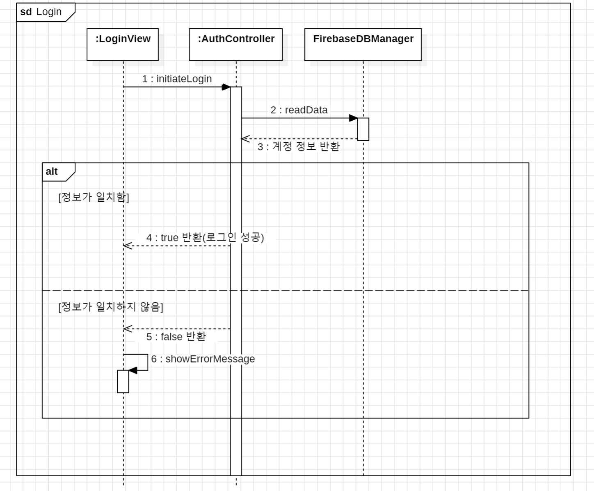

2. 로그인 (Login)

기존 회원이 시스템에 접속할 때 인증 과정을 표현한 Sequence Diagram이다. 사용자가 이메일과 비밀번호를 입력하면 AuthController가 FirebaseDBManager를 호출해 서버에 저장된 회원 정보와 일치하는지 확인한다. 일치한다면 UserAccount 객체를 불러오고 메인 화면으로 전환할 수 있도록 성공값(true)을 반환하며, 틀리다면 LoginView에 등록되지 않은 회원이거나 비밀번호가 틀렸다는 메시지를 띄운다.

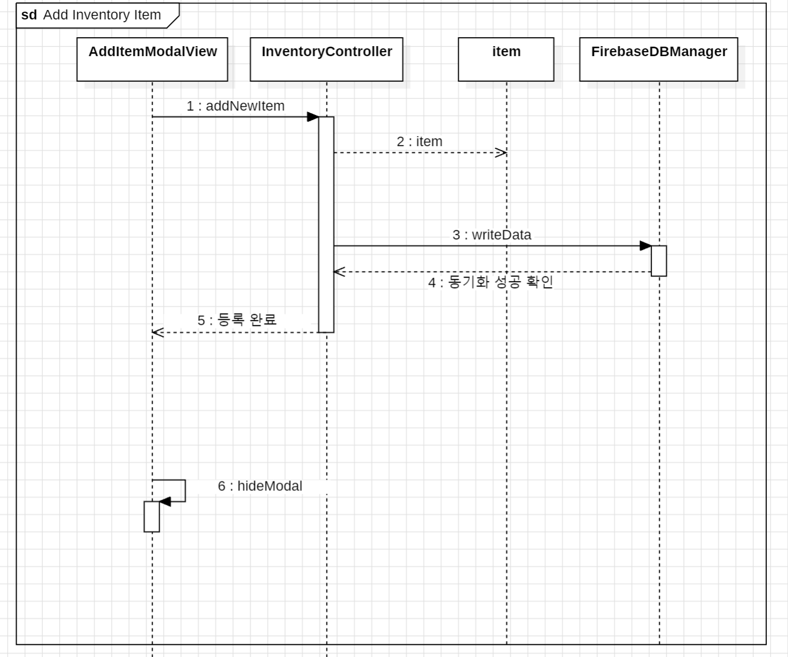

3. 신규 생필품 등록 (Add Inventory Item)

사용자가 새로 구매한 생필품이나 식재료를 시스템에 등록할 때의 흐름을 나타낸 Sequence Diagram이다. 사용자가 모달 창(AddItemModalView)에서 품목명, 수량, 유통기한을 입력하고 저장 버튼을 누르면, 재고 컨트롤러(InventoryController)가 호출된다. 컨트롤러는 입력된 데이터를 바탕으로 메모리상에 새로운 Item 객체를 생성하고, FirebaseDBManager를 통해 서버 DB에 데이터를 기록한다. 저장이 완료되면 모달 창이 닫힌다(hideModal).

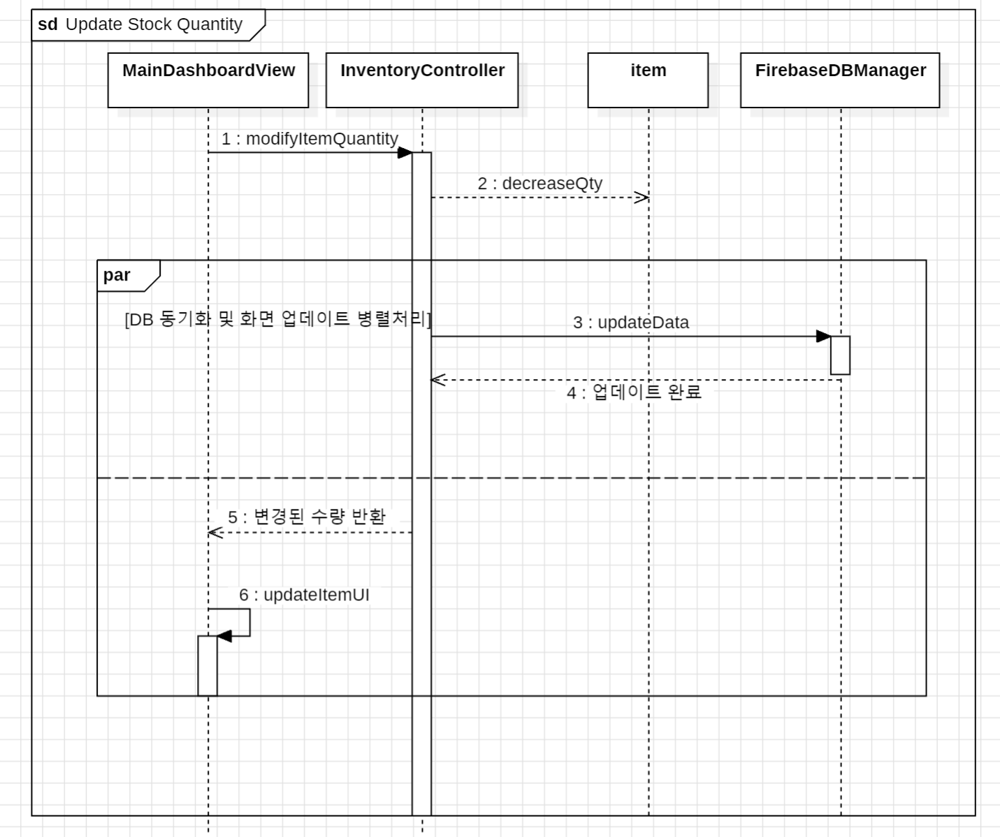

4. 재고 수량 변경 (Update Stock Quantity)

메인 대시보드 화면에서 물건을 소비한 후 수량 감소(-) 버튼을 눌렀을 때 실행되는 흐름을 나타낸 Sequence Diagram이다. MainDashboardView에서 특정 품목의 수량 감소 이벤트를 InventoryController로 전달하면, 컨트롤러는 해당 Item 객체의 내부 수량을 업데이트(decreaseQty)하고 이를 서버 DB에 동기화한다. 변경된 수량은 다시 화면에 즉각 반영(updateItemUI)된다.

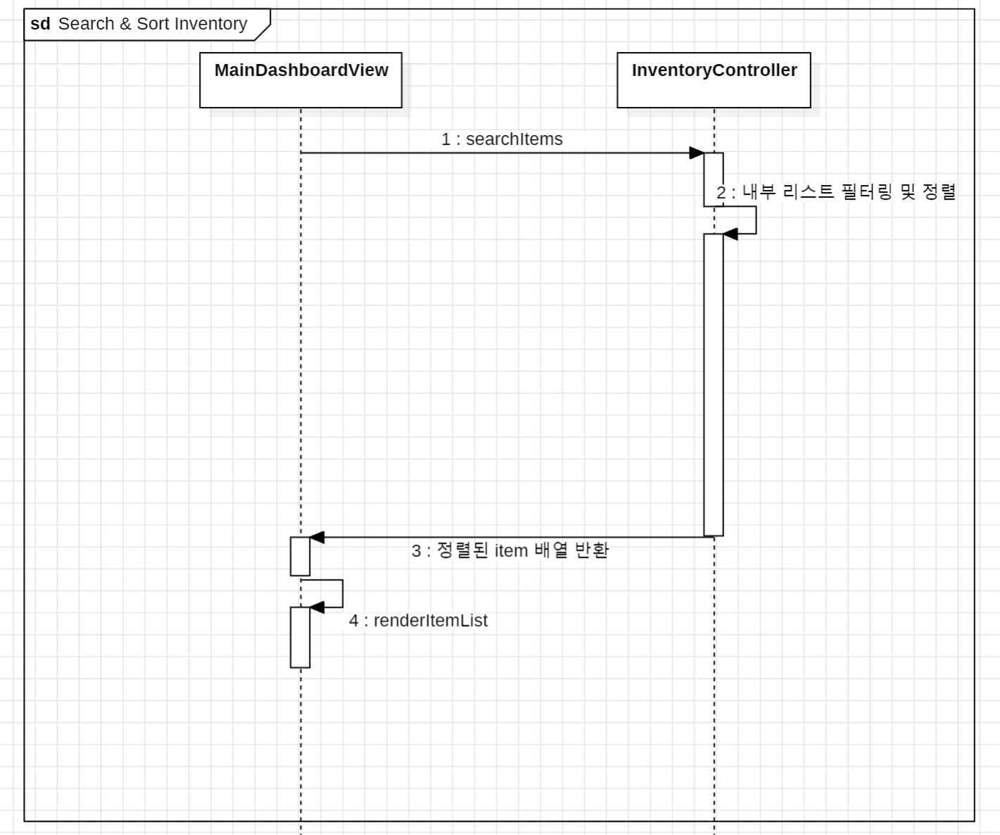

5. 재고 검색 및 정렬 (Search & Sort Inventory)

사용자가 특정 물건을 찾거나 유통기한이 임박한 순서대로 재고 리스트를 정렬할 때의 흐름이다. 사용자가 메인 화면(MainDashboardView)에서 검색어를 입력하거나 정렬 버튼을 누르면, 재고 컨트롤러(InventoryController)가 호출된다. 컨트롤러는 이미 불러와서 가지고 있는 내부 아이템 리스트를 조건에 맞게 필터링하거나 정렬(sortItemsByDate)한 뒤 반환하며, 화면은 이 데이터를 바탕으로 리스트를 다시 렌더링한다.

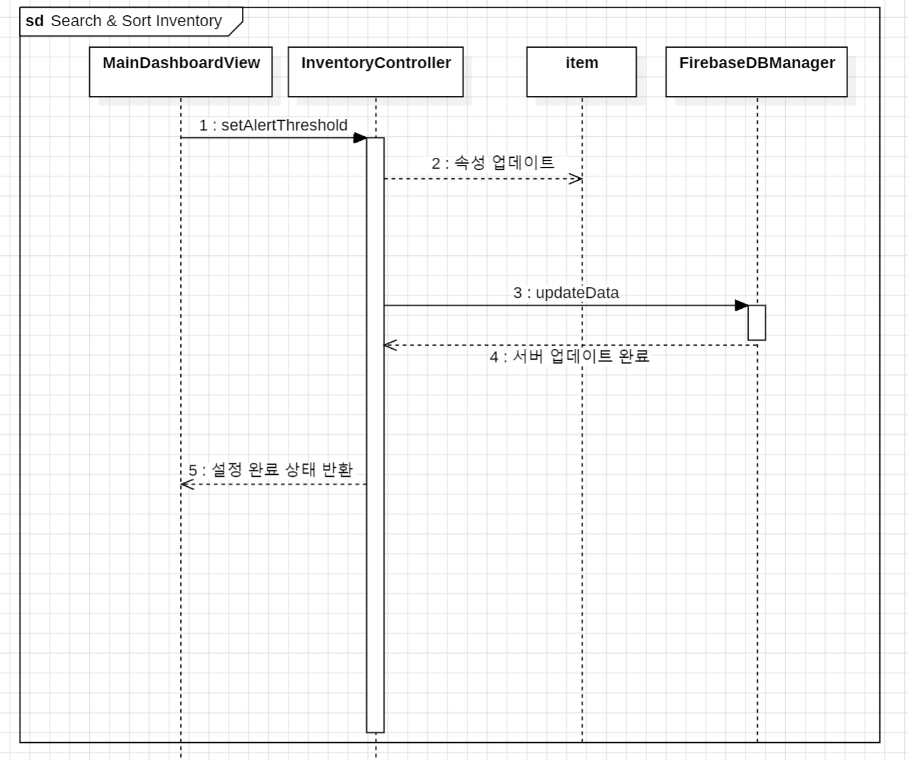

6. 재고 부족 알림 설정 (Set Stock Alert)

특정 생필품이 고갈되기 전에 미리 알림을 받기 위해 최소 유지 수량을 설정하는 과정이다. 사용자가 MainDashboardView에서 임계값을 설정하면, InventoryController를 통해 해당 Item 객체의 최소 알림 수량(minAlertQty) 속성이 업데이트된다. 이후 FirebaseDBManager를 호출하여 변경된 속성 값을 서버에 부분 업데이트(updateData)하고 성공 시 화면에 설정 완료를 표시한다.

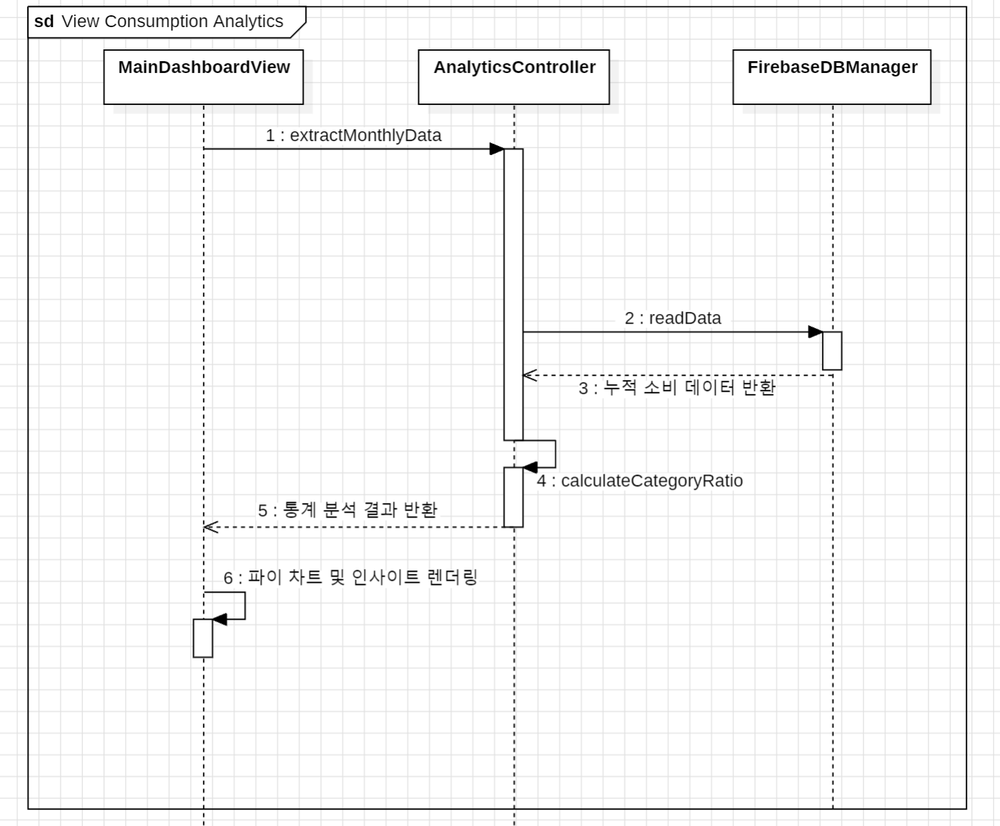

7. 소비 패턴 분석 조회 (View Consumption Analytics)

사용자가 자신의 누적된 재고 사용 데이터를 통해 소비 패턴을 파악하고자 분석 탭을 클릭했을 때의 흐름이다. MainDashboardView가 AnalyticsController를 호출하면, 컨트롤러는 DB 매니저를 통해 한 달간의 소비 기록을 불러온다. 이후 불러온 Item 데이터를 바탕으로 카테고리별 소비 비중을 계산(calculateCategoryRatio)하여 결과를 뷰로 반환하고, 뷰는 이를 파이 차트 형태로 화면에 렌더링한다.

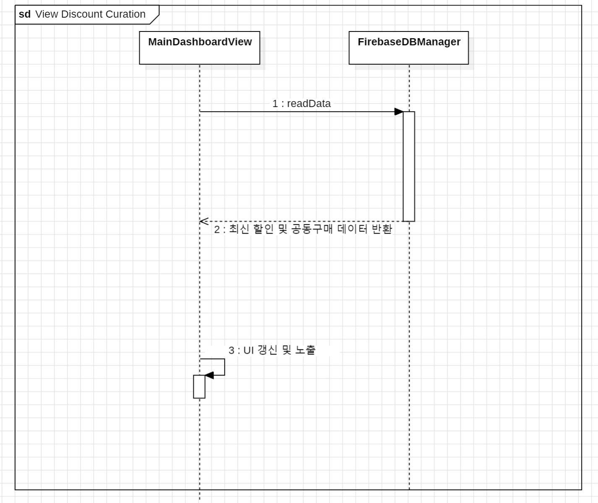

8. 할인 정보 조회 (View Discount Curation)

시스템 관리자가 제공하는 최신 지역 할인 정보를 일반 사용자가 확인하는 과정이다. 별도의 복잡한 로직 없이, 메인 화면(MainDashboardView)이 로드될 때 FirebaseDBManager를 직접 호출하여 서버의 Public 영역(할인 정보 컬렉션)에 저장된 데이터를 읽어온다(readData). 데이터를 성공적으로 받아오면 메인 화면 상단의 프로모션 배너(promoBanner)에 해당 내용을 슬라이드 형태로 노출한다.

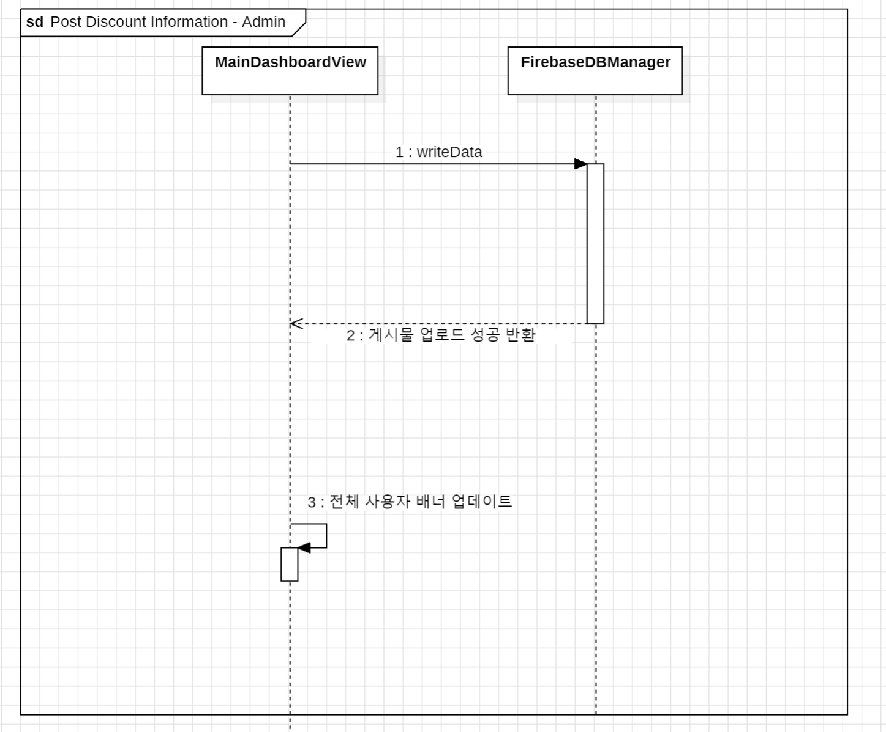

9. 할인 정보 게시 (Post Discount Information - Admin)

시스템 관리자가 제공하는 최신 지역 할인 정보를 일반 사용자가 확인하는 과정이다. 별도의 복잡한 로직 없이, 메인 화면(MainDashboardView)이 로드될 때 FirebaseDBManager를 직접 호출하여 서버의 Public 영역(할인 정보 컬렉션)에 저장된 데이터를 읽어온다(readData). 데이터를 성공적으로 받아오면 메인 화면 상단의 프로모션 배너(promoBanner)에 해당 내용을 슬라이드 형태로 노출한다.

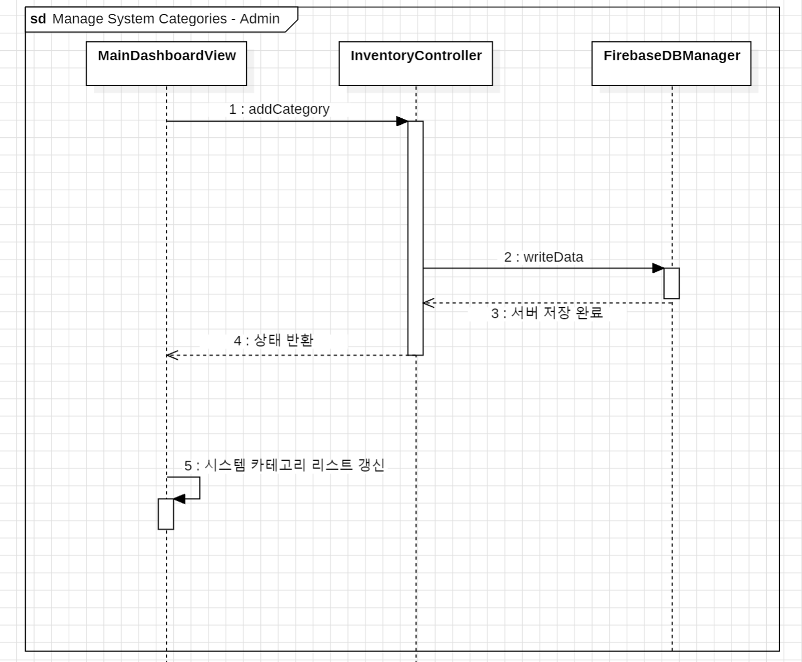

10. 시스템 카테고리 관리 (Manage System Categories - Admin)

사용자들이 물건을 등록할 때 선택하는 표준 카테고리(식품, 세제 등)를 관리자가 생성하거나 수정하는 과정이다. 관리자가 새로운 카테고리 분류 기준을 입력하면, 재고 컨트롤러(InventoryController)를 거쳐 데이터 유효성을 확인한 뒤 DB 매니저를 통해 서버에 저장한다. 이후 변경된 카테고리 메타데이터는 일반 유저들이 폼 작성 시 드롭다운 메뉴에 반영된다.

## 4) State Machine Diagram

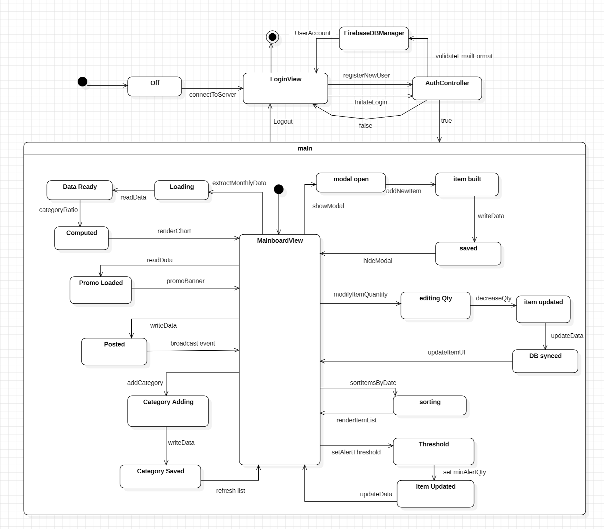

새로운 생필품을 폼에 작성하여 시스템에 임시 등록(Draft ➔ Registered)한 뒤, 정상적으로 동기화가 완료되면 정상 보유(InStock) 상태가 되어 지속적으로 유통기한을 감시하게 된다. 사용자는 재고 수량을 차감하여 최소 알림 수량 이하가 될 경우 재고 부족(LowStock) 상태로 전환시켜 알림을 받을 수 있고, 시간이 지나 기한 임박(ExpiringSoon) 상태가 되면 붉은색 테두리 등 시각적 경고를 받게 된다. 이후 잔여 수량을 모두 소비하여 소진(OutOfStock) 상태가 되면 기능이 비활성화되며, 더 이상 관리가 필요 없는 항목은 사용자가 직접 리스트에서 삭제(Deleted)하여 시스템 내에서 완전히 파기할 수 있다.

## 5. Implementation Requirements
본 HIMS(Household Inventory Management System)를 정상적으로 구동하기 위해 필요한 시스템 요구사항은 아래와 같다.

1) Hardware Requirements

CPU : Intel Core i3 이상

RAM : 4GB 이상

HDD or SSD : 5GB 이상의 여유 공간

Network : 인터넷 연결 필수 (실시간 데이터 동기화용)

2) Software Requirements

Operating System : Microsoft Windows 10 이상 또는 macOS

Implementation Language : Java (version 1.8 이상)

Database : Firebase Realtime DB / Firestore

3) Nonfunctional requirements

해당 HIMS 시스템은 예시 프로그램들처럼 로컬 텍스트 파일(.txt)을 데이터베이스로 사용하지 않고, 클라우드 환경인 'Firebase' 데이터베이스를 연동하여 사용한다.

따라서 시스템을 구동하여 재고를 추가하거나 수량을 변경하는 등의 모든 기능을 정상적으로 수행하려면 기기가 항상 인터넷에 연결되어 있어야 한다. 또한, 데이터베이스 안에서 일반 사용자(User)와 관리자(Admin)의 정보가 섞이지 않도록 각 계정의 고유 식별자(UID)를 기준으로 데이터를 저장하고 불러오도록 구현해야 한다.
마지막으로, 구현 데모 발표 시 원활한 기능 시연을 위해 테스트용 일반 계정과 관리자 계정 데이터를 Firebase 서버에 미리 세팅해 두어야 한다.

## 6. Glossary

| Term | Description |
| :--- | :--- |
| **Class Diagram** | 객체지향형 시스템 설계에서, 시스템을 구성하는 클래스들의 속성과 오퍼레이션, 그리고 그들 간의 정적인 관계(상속, 포함, 의존 등)를 도식으로 정의한 다이어그램. |
| **Sequence Diagram** | 시스템의 동적 모델링을 위해, 특정 유스케이스를 실행할 때 객체들 간의 상호작용과 메시지 교환 과정을 시간의 흐름에 따라 수직적으로 나타낸 다이어그램. |
| **State Machine Diagram** | 시스템 내 특정 객체(예: Item)가 생성부터 소멸까지의 생명주기 동안 겪게 되는 상태의 변화와, 그 상태 변화를 유발하는 이벤트를 설명하는 다이어그램. |
| **Asynchronous** | 작업의 요청과 결과 반환이 동시에 일어나지 않는 처리 방식. 본 시스템에서는 DB에 데이터를 쓰고 읽을 때 화면이 멈추지 않도록 비동기 리스너(Listener) 방식을 사용한다. |
| **UID (User Identifier)** | 사용자가 시스템에 최초 회원가입을 할 때 부여받는 무작위 고유 식별 문자열. 사용자 간의 데이터베이스 접근 권한을 철저히 격리하기 위한 핵심 키(Key)로 사용된다. |
| **Attribute / Operation** | Attribute(속성)는 객체지향 프로그래밍에서 클래스가 가지는 데이터(멤버 변수)를 의미하며, Operation(오퍼레이션)은 해당 데이터를 다루는 행위(멤버 함수, 메서드)를 가리킨다. |

## 7. Reference
StarUML Documentation, MKLabs.
(UML 2.x 규격에 맞춘 다이어그램 모델링 및 컴바인드 프레임(Combined Fragment) 작성 참고)
